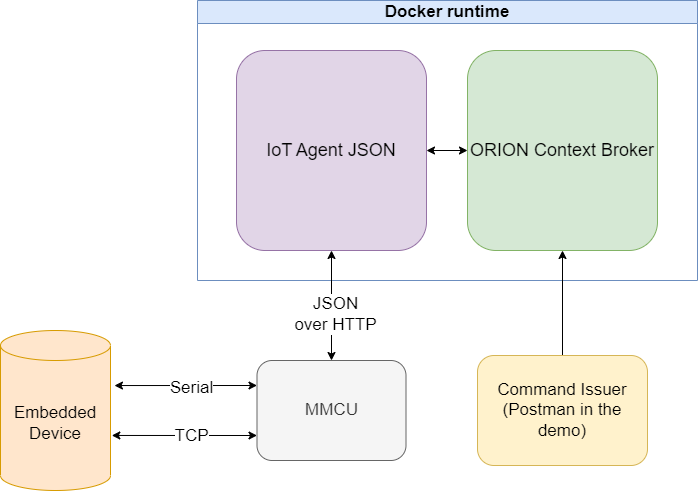
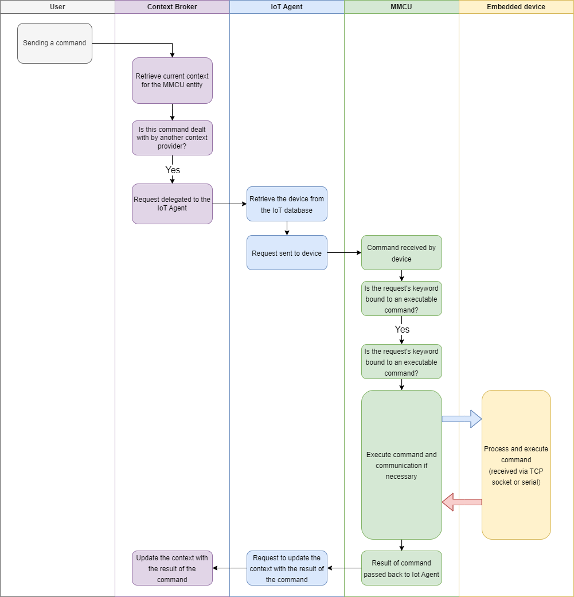

# MMCU Setup example configuration

This document aims to show the user how to set up and run their own instance of 
the MediSCARA Master Control Unit.

> To see the main features of the MMCU see [this](../readme.md) page.

## Prerequisites

You will need Docker to run the neccessary containers. 
Information about the installation can be found [here](https://docs.docker.com/engine/install/).

Python is necessary to run the MMCU, you can install it from [here](https://www.python.org/downloads/).

## Overiview


In the above image we can see the necessary components for the setup.
In the next section we will install and configure every one of the components.

A brief overview of the flow of a command can be seen on the next image:


## Installation

To install the application, navigate to the root of the directory you've downloaded the source to and run `pip install .`.
This will install the necessary files and packages.

### Docker setup

This example configuration provides a [docker-compose.yaml](./docker-compose.yaml) file that can be used to set up the necessary software stack.
Navigate to the file and run `docker compose up -d` to start the containers.
Use `docker compose down -v` to stop and completely remove the installed containers.

To make sure that everything runs in order, run the `docker ps` command.
The output should look something like this:
```
7846e1cfe3c8
a38f3c63da92
01be3f96ff79
```

These are the IDs of the running containers. You should see (at least) three of them.

### IoT Agent setup

Now that we have our containers running, we need to prepare the IoT Agent. 
The steps included in this guide can be found in further detail at [the official tutorial](https://github.com/FIWARE/tutorials.IoT-Agent-JSON).

First we need to provision a service group.

> You can find this and all of the following requests in the Postman collection provided [here](./tutorial.postman_collection.json).

This can be done with the `Create Service Group` request:
``` bash
curl --location --request POST 'localhost:4041/iot/services' \
--header 'fiware-service: mediscara' \
--header 'fiware-servicepath: /' \
--header 'Content-Type: application/json' \
--data-raw '{
    "services": [
        {
            "apikey": "exampleApiKey",
            "entity_type": "Thing",
            "resource": "/iot/json"
        }
    ]
}'
```

The values of `apikey`, `fiware-service`, `fiware-servicepath` and `resource` will be used later, so dont forget about them.

The response should be `201 Created`.

Next, we need to add the MCU itself, as an IoT Device.
This can be done with the `Create MCU` request:
```bash
curl --location --request POST 'localhost:4041/iot/devices' \
--header 'fiware-service: mediscara' \
--header 'fiware-servicepath: /' \
--header 'Content-Type: application/json' \
--data-raw '{
    "devices": [
        {
            "device_id": "MCUTest",
            "entity_name": "MCU:Test",
            "entity_type": "MCU",
            "protocol": "PDI-IoTA-JSON",
            "transport": "HTTP",
            "endpoint": "http://host.docker.internal:6900/api",
            "attributes": [
                {
                    "object_id": "e",
                    "name": "error",
                    "type": "Text"
                }
            ],
            "commands": [
                {
                    "name": "start_laser_cut",
                    "type": "command"
                },
                {  
                    "name": "home",
                    "type": "command"
                }
            ]

        }
    ]
}'
```

The endpoint should point to the IP address of the MCU (the _host.docker.internal_ host functions as an alias for the _localhost_ in this case).
In this request, we can define attributes and commands for the MCU. These command values will be the _keywords_ for the MCU Commands.

The response should be `201 Created` here as well.

After these steps we are ready to configure the MCU itself.

### MCU setup

First, we need to configure the environment variables for the MMCU.
This can be done via the [.env](../.env) file.

The `API_KEY`, `FIWARE_SERVICE` and `FIWARE_SERVICEPATH` varables need to have the same values as the parameters we sent when we provisioned the service group.
The `IOTA_PATH` needs to be set to the value of `resource` from the same request.

The `MCU_ID` is the same as the `device_id` parameter from the previous request (here "_MCUTest_").

The `IOTA_URL` is the URL of the IoT Agent (_localhost:7896_). The host is the ip address of the MCU and the port is the port of the MCU (_localhost:6900_ as you can see in the previous request). 

After this, we can run the MCU in a terminal with the `mcu` command.
You should see the following:
```
 * Serving Flask app 'mcu.mcu'
 * Debug mode: off
 ```

 This means the MCU has started successfully.

 ### Adding a custom command

 Now we have a working MCU unit but it is not worth much without commands that can be executed.

 To create a new command, make a python file in the _/src/mcu/external_ directory. In this guide, we will call it [example.py](../src/mcu/external/example.py).

 Then create a class that inherits from the `mcu.user_defined.Command` class. The file should look like this:

 ```python
 """This is an example module demonstrating the usage of the MMCU"""

# import the command class
from mcu.models.user_defined import Command

# import the necessary methods for registering embedded communication protocols
from mcu.config import add_serial_server, add_tcp_server


class ExampleCommand(Command):
    """This is the example command class that is run by the MCU

    It should always inherit from the Command class imported above

    This class sends a message via TCP socket and serial communication whenever the incoming command
    contains the 'exampleKeyword' key. 
    The command is sent from an IoT Agent and it uses the JSON protocol as its payload.
    """
```

Now we have to implement the `__init__` method:
```python
def __init__(self) -> None:
    # register the superclass with the keyword
    # whenever a new FIWARE command comes in and matches with the given keyword, the class' 'target' method will be executed
    super().__init__(keywords=['start_laser_cut'])

    # request a tcp socket server from the runtime
    self.tcp = add_tcp_server('localhost', 2000)

    # register callback methods for the events regarding the server
    self.tcp.register_callbacks(connected=self.on_tcp_connected,
                                lost=self.on_tcp_connection_lost,
                                received=self.on_tcp_received
                                )
```

There are some errors in the code, so we will need to define the callback methods for the socket communctication.

```python
def on_tcp_connected(self, client: str):
    """This method is called when a new socket client is connected to the server"""
    print(f"New connection from {client}")

def on_tcp_connection_lost(self):
    """This method is called when a socket client is disconnected from the server"""
    print("A client has disconnected")

def on_tcp_received(self, msg: bytes):
    """This method is called when data is received from a socket client"""
    print("Incoming message: ", msg.decode())


    if msg == b'OK':
        # update the info attribute
        self.update_attribute('info', 'OK')
```

Finally, we will need to define the `target` method. This method will be executed when the IoT Agent send a command with the `start_laser_cut` key.

```python
def target(self, *args, keyword: str):
    """This method is executed whenever one of the registered keywords match the incoming request"""

    # send a message via socket
    self.tcp.send("HOME")

    # report back to the runtime
    # dont update the status as it will come back later through TCP socket
    self.result = None
```


## Using the MMCU 

We have provided a simple [python script](./dummy_embedded_device.py) to emulate an embedded device's homing sequence.

To issue a command to the MMCU, you can use the `Send Home Command` request:
```bash
curl --location --request PATCH 'localhost:1026/v2/entities/MCU:Test/attrs' \
--header 'fiware-service: mediscara' \
--header 'fiware-servicepath: /' \
--header 'Content-Type: application/json' \
--data-raw '{
    "home": {
        "type": "command",
        "value": ""
    }
}'
```

This should return a `204 No Content` response.

After you send the command, the MCU will execute the `target` method. 
Because we set the `result` variable to an empty string, the `home_info` attribute will only be updated to _RECEIVED_. 

> To view the MCU status use the `Get entities` request:
> ```bash
> curl --location --request GET 'host.docker.internal:1026/v2/entities/' \
> --header 'fiware-service: mediscara' \
> --header 'fiware-servicepath: /'
> ```

The status of the home command can be seen here:
```json
"home_info": {
    "type": "commandResult",
    "value": "RECEIVED",
    "metadata": {
        "TimeInstant": {
            "type": "DateTime",
            "value": "2023-02-09T13:36:24.851Z"
        }
    }
}
```

This means the MCU has received a command, but the result has not yet been determined.

After a delay, the dummy device will send an 'OK' message to the MCU, signaling the end of the homing sequence. 
This means that we can update the info attribute using the `update_attribute` method. 

The result of the home command should look like this:
```json
"home_info": {
    "type": "string",
    "value": "OK",
    "metadata": {
        "TimeInstant": {
            "type": "DateTime",
            "value": "2023-02-09T13:37:12.031Z"
        }
    }
}
```


